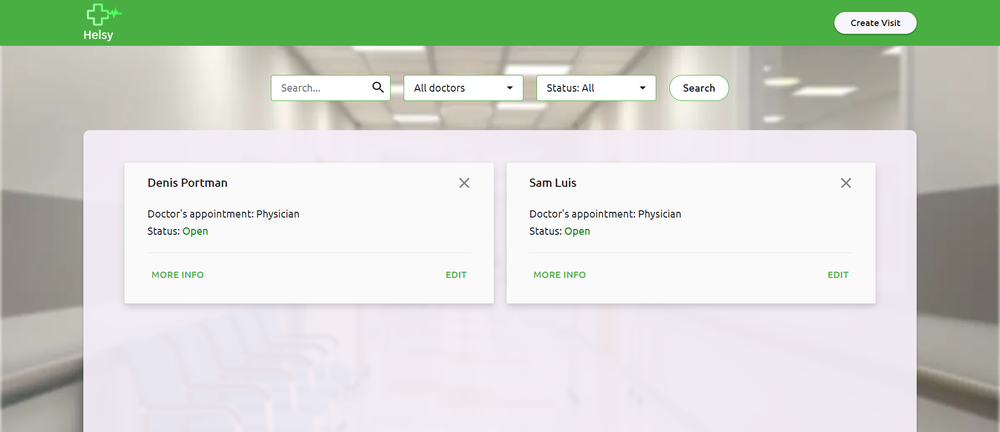

# CMS for helsy clinic

 
 
CMS for clinic, which helps manager handle visits

## Main features

- Authorization, Log in
- Live filter
- Adding cards
- Visit card editor
- Deletion cards
- Responsive web-design

Used technologies:

- SCSS
- JavaScript(ES6+)
- HTML5
- Gulp

## Installation

1. `npm install` or `yarn install`
2. `npm run start` or `yarn start`

